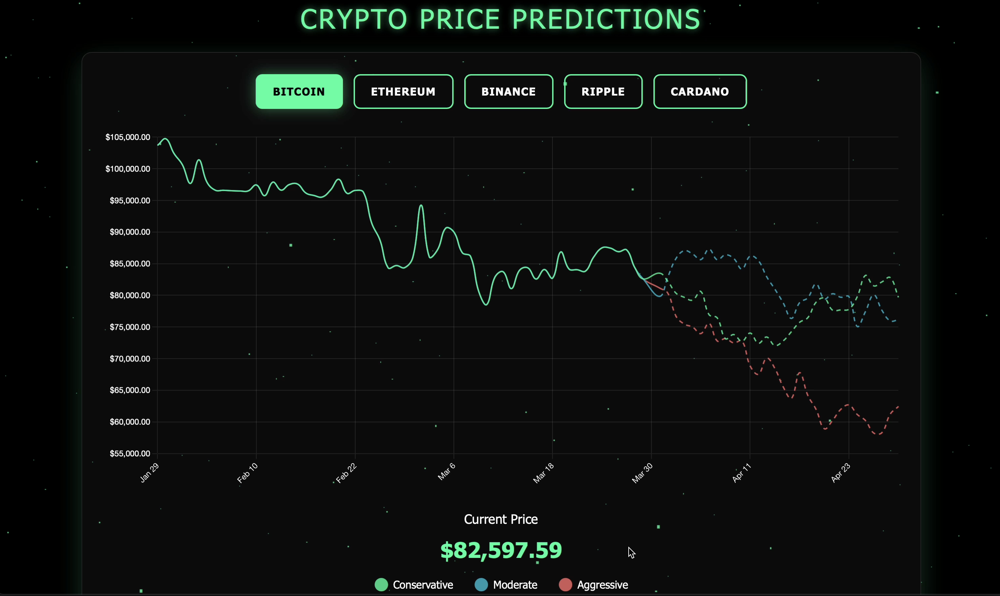

# Cryptocurrency Price Prediction Dashboard

A modern web application that provides real-time cryptocurrency price tracking and future price predictions using machine learning models. The application features an interactive dashboard with beautiful visualizations and supports multiple cryptocurrencies including Bitcoin, Ethereum, Binance Coin, Ripple, and Cardano.



## Features

- **Real-time Price Tracking**: Fetches current prices for major cryptocurrencies using the Yahoo Finance API
- **Interactive Visualizations**: Beautiful line charts with three prediction scenarios:
  - Conservative prediction
  - Moderate prediction
  - Aggressive prediction
- **Technical Indicators**: Includes SMA (Simple Moving Average) calculations
- **Modern UI/UX**: 
  - Dark theme with neon accents
  - Responsive design
  - Interactive 3D background
  - Smooth animations
- **Multiple Cryptocurrencies Support**:
  - Bitcoin (BTC)
  - Ethereum (ETH)
  - Binance Coin (BNB)
  - Ripple (XRP)
  - Cardano (ADA)

## Technology Stack

- **Backend**:
  - Python 3.x
  - Flask
  - yfinance (Yahoo Finance API)
  - NumPy & Pandas for data processing
  - Technical Analysis library (ta)

- **Frontend**:
  - HTML5/CSS3
  - JavaScript
  - Chart.js for visualizations
  - Three.js for 3D background
  - GSAP for animations

## Installation

1. Clone the repository:
   ```bash
   git clone https://github.com/yourusername/crypto-price-prediction.git
   cd crypto-price-prediction
   ```

2. Create and activate a virtual environment (recommended):
   ```bash
   python -m venv venv
   source venv/bin/activate  # On Windows: venv\Scripts\activate
   ```

3. Install the required packages:
   ```bash
   pip install -r requirements.txt
   ```

## Usage

1. Start the Flask application:
   ```bash
   python app.py
   ```

2. Open your web browser and navigate to:
   ```
   http://127.0.0.1:5000
   ```

3. Select different cryptocurrencies using the buttons at the top of the dashboard to view their predictions.

## Project Structure

```
├── app.py                 # Main Flask application
├── data/
│   ├── data_fetcher.py   # Cryptocurrency data fetching logic
│   └── preprocessor.py    # Data preprocessing utilities
├── models/
│   ├── random_forest.py  # Random Forest model
│   ├── lstm.py          # LSTM model
│   └── arima.py         # ARIMA model
├── static/
│   ├── css/             # Stylesheets
│   └── js/              # JavaScript files
├── templates/
│   └── index.html       # Main dashboard template
└── requirements.txt      # Project dependencies
```

## API Endpoints

- `/`: Main dashboard
- `/predict`: Generate price predictions
- `/api/latest_prices`: Get current cryptocurrency prices
- `/api/historical_data`: Get historical price data

## Contributing

Contributions are welcome! Please feel free to submit a Pull Request.

## License

This project is licensed under the MIT License - see the [LICENSE](LICENSE) file for details.

## Acknowledgments

- Data provided by Yahoo Finance
- Chart.js for the beautiful visualizations
- Three.js for the 3D background effects

## Contact

For any queries or suggestions, please open an issue in the GitHub repository.

---
**Note**: This is a demonstration project and should not be used as financial advice. Cryptocurrency investments are subject to market risks. 